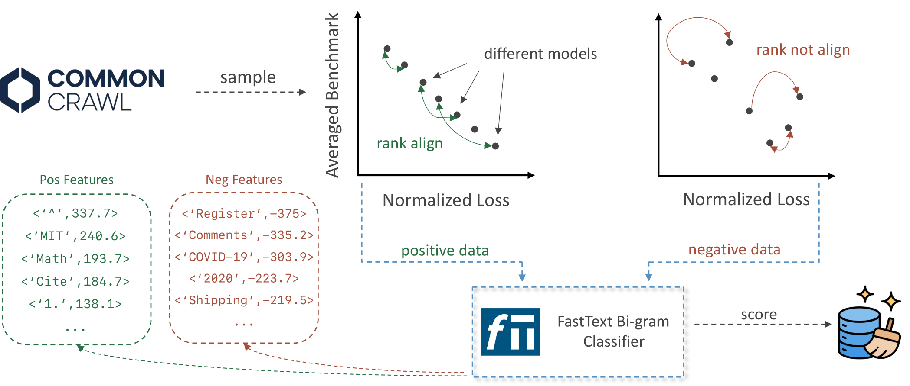

# Predictive Data Selection: The Data That Predicts Is the Data That Teaches 
<p align="center">
    📑 <a href="https://arxiv.org/abs/2503.00808" target="_blank">Paper</a> &nbsp&nbsp | &nbsp&nbsp 🔨 <a href="https://huggingface.co/hkust-nlp/preselect-fasttext-classifier" target="_blank">fastText Classifier</a> &nbsp&nbsp | &nbsp&nbsp 🤗 <a href="https://huggingface.co/datasets/hkust-nlp/PreSelect-100B" target="_blank">Released Dataset</a> &nbsp&nbsp | &nbsp&nbsp 📦 <a href="https://github.com/hkust-nlp/PreSelect" target="_blank">Repo</a>  
<br>
</p>

## 🌟Introduction
<p align="center" width="100%">

</p>
Language model pretraining involves training on extensive corpora, where data quality plays a pivotal role. In this work, we aim to directly estimate the contribution of data during pretraining and select pretraining data in an efficient manner. 
Specifically, we draw inspiration from recent findings showing that compression efficiency (i.e., the normalized loss) of diverse models on certain text correlates strongly with their downstream performance, when the text domain aligns with the downstream benchmark. Building on this observation, we hypothesize that *data on which model losses are predictive of downstream abilities also contribute effectively to learning*.
To leverage this insight, we introduce data selection based on data's Predictive strength (PreSelect), a lightweight and efficient data selection method that requires training and deploying only a fastText-based scorer. Through comprehensive experiments with 1B and 3B parameter models, we demonstrate that PreSelect trained on 30B tokens surpasses the performance of a vanilla baseline trained on 300B tokens, achieving a 10x reduction in compute requirements. Furthermore, PreSelect significantly outperforms other competitive data selection baselines, such as DCLM and FineWeb-Edu.

## Table of content
- [Predictive Data Selection: The Data That Predicts Is the Data That Teaches](#predictive-data-selection-the-data-that-predicts-is-the-data-that-teaches)
  - [🌟Introduction](#introduction)
  - [Table of content](#table-of-content)
  - [📦Released Resources](#released-resources)
  - [Environment Setup](#environment-setup)
  - [🛠Filtering](#filtering)
    - [Direct Use](#direct-use)
    - [Train own FastText](#train-own-fasttext)
      - [Step 1: BPC Calculation for a subset](#step-1-bpc-calculation-for-a-subset)
      - [Step 2: Train Fasttext](#step-2-train-fasttext)
      - [Step 3: Filtering](#step-3-filtering)
  - [🛠Training](#training)
  - [🔍Evaluation](#evaluation)
  - [🖊️Citation](#️citation)
  - [🤝 Acknowledgement](#-acknowledgement)


## 📦Released Resources
We release our trained fasttext calssifier and a 100B token filtered high-quality dataset in Huggingface for direct use.

|Name|Type|Huggingface Link|
|-|-|-|
|preselect-fasttext-calssifier|Model|[🤗Huggingface](https://huggingface.co/hkust-nlp/preselect-fasttext-classifier)|
|preselect-100B|Dataset|[🤗Huggingface](https://huggingface.co/datasets/hkust-nlp/PreSelect-100B)|


## Environment Setup

We provide a dockerfile that contains the environment for filtering, trianing and evaluation.
```bash
docker build -t preselect:latest .
docker run --gpus all --network host -it --shm-size=20g  --privileged  preselect:latest
```
After that, you need to prepare your pretrianing corpus (i.e. download commoncrawl subset). We provide a example to download the DCLM's Refinedweb. Note this will require you to set up aws service beforehand.
```bash
cd data_processing/data/clean_pool
pythondownload.py
python unzip.py
```
You can also prepare your own data.

## 🛠Filtering

### Direct Use
If you want to directly use our trained fasttext, you can download it from huggingface and run the following code:
```python
import os
import argparse

from pathlib import Path

parser = argparse.ArgumentParser("Filter")
parser.add_argument("--input_path",type=str, help="input path name")
parser.add_argument("--output_path",type=str, help="output path name")

args = parser.parse_args()
from datatrove.executor import LocalPipelineExecutor
from datatrove.pipeline.filters import FastTextClassifierFilter
from datatrove.pipeline.readers import ParquetReader,JsonlReader
from datatrove.pipeline.writers.jsonl import JsonlWriter
Path(f"{args.output_path}").mkdir(parents=True,exist_ok=True)

dist_executor = LocalPipelineExecutor(
    skip_completed=True,
    pipeline=[
        JsonlReader(f"{args.input_path}", text_key="text", default_metadata= {}),
        FastTextClassifierFilter(f"PreSelect-classifier.bin", keep_labels=[("1",0.5)]), 
        JsonlWriter(f"{args.output_path}", compression=None)
    ],
    tasks=100,
)
dist_executor.run()
```

### Train own FastText
#### Step 1: BPC Calculation for a subset
The first step is to pick a small subset and calculate the bpc for each example for each model.
```bash
cd data_processing/bpc
python -u main.py\
    --model_name {MODEL_NAME}\
    --block_size 1900\
    --stride 512 \
    --batch_size 1\
```

#### Step 2: Train Fasttext
Then you can train the fasttext using the data computed in Step 1.
```bash
cd data_processing/fasttext
python train_fasttext.py
```
#### Step 3: Filtering
Finally, you can filter your large corpus using the fasttext. The provided script works on one cpu machine, but it can be easily extend to multi machine filtering.
```bash
bash pipelie.sh {FASTTEXT_NAME} filter NO NO NO NO 0 NO 1 0.1
```


## 🛠Training
If you are training with single node (e.g. 8 gpus), you can use the following command
```bash
bash pipeline.sh {FASTTEXT_NAME} NO tokenize train convert NO 0 NO 1 0.1 {HOME_PATH} 1 {TRAINING_STEPS}
```
If you are training with multi node (e.g. 8 gpus * 4 node), you can use the following command
```bash
bash pipeline_multi_node.sh {FASTTEXT_NAME} NO tokenize train convert NO {MAIN_NODE_ADDRESS} NO 1 0.1 {HOME_PATH} {N_NODE} {TRAINING_STEPS}
```

For more information, you can refer to the pipeline script.

## 🔍Evaluation
You can refer [Opencompass](https://github.com/open-compass/opencompass) and [LM-Evaluation-Harness](https://github.com/EleutherAI/lm-evaluation-harness) to setup the evaluation for trained checkpoints to fit your need.

## 🖊️Citation
If you find this work helpful, please kindly cite as:
```
@article{shum2025predictivedataselectiondata,
      title={Predictive Data Selection: The Data That Predicts Is the Data That Teaches}, 
      author={Kashun Shum and Yuzhen Huang and Hongjian Zou and Ding Qi and Yixuan Liao and Xiaoxin Chen and Qian Liu and Junxian He},
      journal={arXiv preprint arXiv:2503.00808},
      year={2025},
      eprint={2503.00808},
}
```

## 🤝 Acknowledgement
Thanks for the open-source of the following projects where some code in this project is cited and modified from them:
- [Compression Represents Intelligence Linearly](https://github.com/hkust-nlp/llm-compression-intelligence)
- [datatrove](https://github.com/huggingface/datatrove)
- [Megatron-LM](https://github.com/NVIDIA/Megatron-LM)
- [MAP-NEO](https://github.com/multimodal-art-projection/MAP-NEO)
- [Opencompass](https://github.com/open-compass/opencompass)
